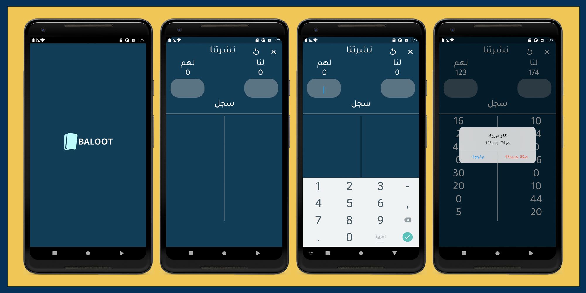

    

# image_encryption (B9mah) :

In this project, I developed an application using the Dart language (Flutter),
An application for calculating points for the famous baloot game, with a beautiful design and comfortable colors ,you can go back to the previous recording and you can also start a new game.

# Download:

https://play.google.com/store/apps/details?id=com.Baloot.Nawaf

